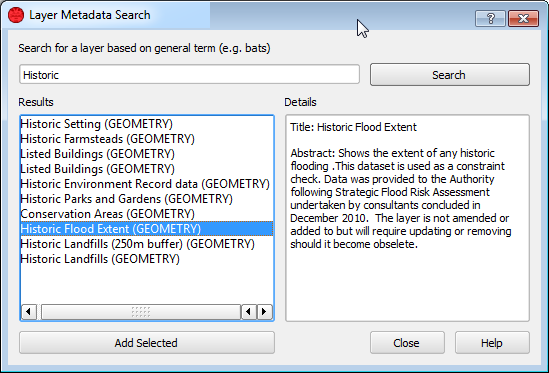
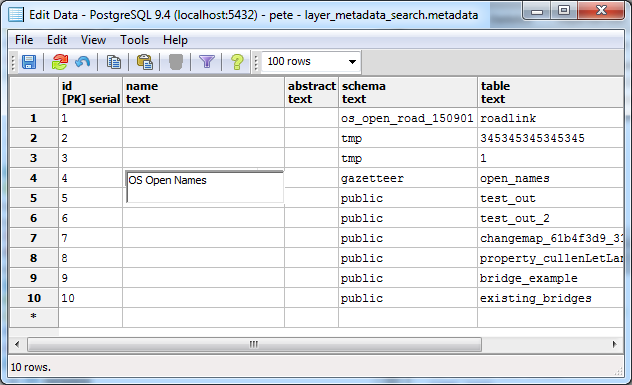
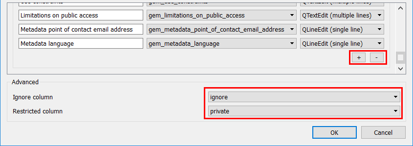

# Layer Metadata Search

Layer Metadata Search is a plugin used to search GIS metadata. Layer Metadata Search can be used to search data describing the "who, what, where, when and how" of map layers. Layer Metadata Search was developed on behalf of Dartmoor and Exmoor National Parks, UK.

Layer Metadata Search requires metadata to be stored in a PostgreSQL table with the following minimum information. Table column names need not be exactly the same as those described below.

**title** - Human readable title of the dataset, e.g. Ordnance Survey Open Roads or Aerials.

**type** - Dataset type: 'vector' or 'raster'.

**abstract** - An abstract for the dataset, e.g. A nationally consistent, high-level and shareable view of GB's road network. OS Open Roads is a connected road network for Great Britain. It contains all classified roads (such as motorways and A & B roads) as well as officially named unclassified roads.

**other fields** - The plugin can also search on and display other custom metadata fields - described later.

**schema** - The PostgreSQL schema containing the PostGIS table.

**table** - The name of the PostGIS table.

Once configured, Layer Metadata Search will search for datasets using the title, abstract and any other custom metadata fields.

## Configuration

Layer Metadata Search can be configured in QGIS via `Plugins` > `Layer Metadata Search` > `Configure Layer Metadata Search` which will open the following dialog:

The *Custom / additonal metadata columns* section of the configuration is described later. 

## Metadata Preparation

This section describes how to set up a PostgreSQL table for the matadata.

First, create a new metadata table and schema if required:

	CREATE SCHEMA layer_metadata_search;
	CREATE TABLE layer_metadata_search.metadata
    (
      id serial NOT NULL,
      name text,
      type text NOT NULL DEFAULT 'vector'::text,
      abstract text,
      schema text,
      "table" text,
      path text,
      keywords text, -- optional, one of the custom columns
      mod_date date, -- optional
      tstamp timestamp without time zone, -- optional
      CONSTRAINT metadata_pkey PRIMARY KEY (id)
    );

### Adding vector layers

With the table created we can automatically populate it with layers we already have in our database. The following command will add rows to the metadata table for any tables not already featured in the metadata table:

	INSERT INTO layer_metadata_search.metadata
		(schema, "table")
	SELECT
		f_table_schema,
		f_table_name
	FROM
		geometry_columns LEFT OUTER JOIN layer_metadata_search.metadata ON
			f_table_schema = "schema" AND 
			f_table_name = "table"
	WHERE
		"schema" IS NULL AND
		"table" IS NULL;

Now we can simply open the metadata table in pgAdminIII and add the titles and abstracts:

### Adding raster layers

Users are encouraged to create virtual raster files (VRT) for raster groups and add them to the metadata table instead of adding single raster files. This way users will get a single search result for a particular raster group (Aerials, LiDAR etc.) and will be able to load all the rasters at once. Virtual raster files can be easily created using [gdalbuildvrt](http://www.gdal.org/gdalbuildvrt.html) from GDAL. Adding single raster files is still possible tough.

For raster files, the following columns of the metadata table are required:

 * name -- user-friendly name
 * type = 'raster'
 * path -- absolute path to the raster file

## Using Custom Metadata Fields

This section describes how to make use of custom metadata fields in the Layer Metadata Search plugin.

1. First ensure that the metadata table contains the fields you wish to work with.
1. Now open up the configuration dialog:

	

	The `+`/`-` buttons can be used to add new metadata entries.

	**Description** - how this field will be displayed in search results.

	**Column** - source metadata column.

	**Widget type** - How the metadata should be displayed.  Options include LineEdit (display as text across a single line), TextEdit (similar but across multiple lines) and DateEdit (for displaying dates).

	*Please note that when using the DateEdit widget the source column in the database should be of type `date`*

## Upgrading from an earlier version

To support raster datasets, existing plugin's databases have to be modified in the following manner:

    -- Add a column for layer type (vector/raster)
    ALTER TABLE layer_metadata_search.metadata ADD COLUMN type text NOT NULL default 'vector';

    -- Add a column for raster file path
    ALTER TABLE layer_metadata_search.metadata ADD COLUMN path text;

    -- Set the type for currently existing vector laters
    UPDATE layer_metadata_search.metadata SET type = 'vector';

When adding a dataset, always specify its type as either 'vector' or 'raster'.