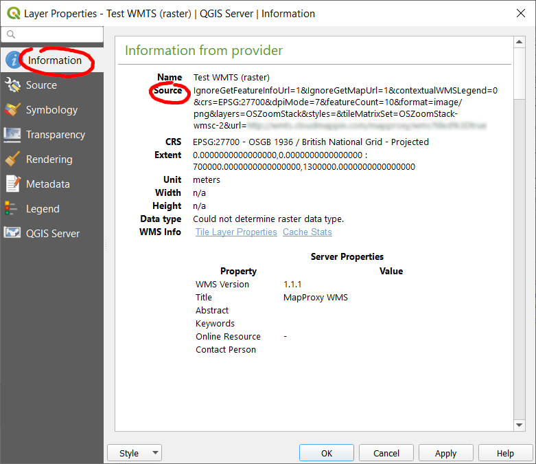

# Layer Metadata Search

*Layer Metadata Search* is a plugin used to search GIS metadata. *Layer Metadata Search* can be used to search data describing the "who, what, where, when and how" of map layers and is flexible so can support GEMINI 2 as well as other metadata standards. *Layer Metadata Search* was initially developed on behalf of Dartmoor and Exmoor National Parks in the UK.

*Layer Metadata Search* requires that metadata be stored in a PostgreSQL table with the following **minimum** information. Table column names need not be the same as those described below.

**Dataset type** - A column containing values describing whether the dataset is a PostGIS table, raster file or WMS layer.  The column could contain values like `PostGIS`, `Raster` and `WMS` and should not contain NULL values.

**Title** - Human readable title of the dataset, e.g. *Ordnance Survey Open Roads* or *Aerial photos*.

**Abstract** - An abstract for the dataset, e.g. *A nationally consistent, high-level and shareable view of GB's road network. OS Open Roads is a connected road network for Great Britain. It contains all classified roads (such as motorways and A & B roads) as well as officially named unclassified roads.*

**Layer schema** - For PostGIS datasets, the schema containing the table.

**Layer table** - For PostGIS datasets, the name of the table.

**Raster path** - For raster file and WMS datasets, the path or source URL of the dataset.

**Other fields** - The plugin can also search on and display other custom metadata fields - described later.

Once configured, *Layer Metadata Search* will search for datasets using all configured metadata fields.

## Configuration

Layer Metadata Search can be configured in QGIS via `Plugins` > `Layer Metadata Search` > `Configure Layer Metadata Search` which will open the following dialog:

Simply complete the *Metadata table* and *Required metadata table columns* sections.  The *Vector*, *Raster* and *WMS identifier* entries should be populated with the values in the *Dataset type* column which correspond with each of the dataset types. 

The *Custom / additional metadata columns* and *Advanced* sections of the configuration are described later. 

## Metadata preparation

This section describes how to set up a PostgreSQL table for the metadata.

First, create a new metadata table and schema if required:

	CREATE SCHEMA IF NOT EXISTS metadata;
	CREATE TABLE metadata.all_metadata
    (
      id serial NOT NULL,
      dataset_type text NOT NULL DEFAULT 'PostGIS Table'::text,
      schema_name text, -- required for vector datasets
      table_name text, -- required for vector datasets
      path text, -- required for raster and WMS datasets
      gem_title text,
      gem_abstract text,
      ignore boolean DEFAULT false, -- optional: boolean flag as to whether row should be ignored
      pivate boolean DEFAULT false, -- optional: boolean flag as to whether this dataset might have restricted access
      qgis_pg_connection text, -- optional: preferred PostGIS connection for loading loading layers
	  -- define any additional, custom columns here as required
      CONSTRAINT all_metadata_pkey PRIMARY KEY (id)
    );

### Adding vector layers

With the table created we can automatically populate it with layers we already have in our database. The following query will add rows to the metadata table for any tables not already featured in the metadata table:

	INSERT INTO metadata.all_metadata
		(dataset_type, schema_name, table_name)
	SELECT
		'PostGIS Table',
		f_table_schema,
		f_table_name
	FROM
		geometry_columns LEFT OUTER JOIN metadata.all_metadata ON
			f_table_schema = schema_name AND 
			f_table_name = table_name
	WHERE
		schema_name IS NULL AND
		table_name IS NULL;

Now we can simply open the metadata table in pgAdmin and add the titles and abstracts (your table definition may vary):

### Adding raster layers

A raster dataset / layer may consist of a single image, or multiple image tiles which, together, make up the entire layer.

For tiled layers, users are encouraged to create virtual raster files (VRT) which reference all tiles within a layer in a single VRT file. This allows a single metadata entry to be added to the table describing the whole layer.

Virtual raster files can be easily created using [gdalbuildvrt](http://www.gdal.org/gdalbuildvrt.html) (part of GDAL). This tool can also be found in QGIS under *Raster* > *Miscellaneous* > *Build Virtual Raster*. 

For layers consisting of a single image there is no need to create a VRT file.

For raster files, the following columns of the metadata table should be populated as a minimum:

 * gem_title (user-friendly name)
 * dataset_type (set to, for example, `Raster`)
 * path (absolute path to the raster file)

### Adding WMS layers

WMS layers can be specified by populating the *path* column in the metadata table with the QGIS *source* of the layer.

To see a WMS layer's source, double-click its entry in the QGIS legend and open the *Information* tab:

The *Source* value highlighted above can be copied into the *path* column of the metadata table which will allow QGIS to load the layer.

For WMS layers, the following columns of the metadata table should be populated as a minimum:

 * gem_title (user-friendly name)
 * dataset_type (set to, for example, `WMS`)
 * path (source definition as described above)

## Custom metadata fields and advanced settings

To search and display custom metadata fields:

1. First ensure that the metadata table contains the fields you wish to work with.
2. Open up the configuration dialog:

	

	The `+`/`-` buttons can be used to add new metadata entries.

	**Description** - how this field will be displayed in search results.

	**Column** - source metadata column.

	**Widget type** - How the metadata should be displayed.  Options include LineEdit (display as text across a single line), TextEdit (similar but across multiple lines) and DateEdit (for displaying dates).

	*Please note that when using the DateEdit widget the source column in the database should be of type `date`*

Under *Advanced* there are options for *Ignore*, *Restricted* and *QGIS PostGIS connection* column.

Rows in the metadata table with their *Ignore* column set to `TRUE` will not appear in search results. The *Ignore* column should be of type `boolean`. Set this configuration option to `--DISABLED--` to disable this behaviour.

Rows in the metadata table with their *Restricted* column set to `TRUE` will not appear in search results unless the user has enabled the *Also show results I may not have access to* option. This function may be useful if you wish users to be able to browse all metadata, even for tables which they may not have database permissions to load. The *Restricted* column should be of type `boolean`. Set this configuration option to `--DISABLED--` to disable this behaviour.

The Layer Metadata Search tool also supports the searching of layers from different databases, however, all metadata must be stored in a single metadata table in one database. To include a metadata row for a table in another database, simple fill out its metadata as normal including its schema and table name in the other database.  Also add the name of the **PostGIS connection as named in QGIS** to the `qgis_pg_connection` column (see above table structure) and also set *QGIS PostGIS connection column* to `qgis_pg_connection`.

Now users will be able to locate tables in other databases and the Layer Metadata Search tool will use the connection details from within QGIS for the named connection specified. 