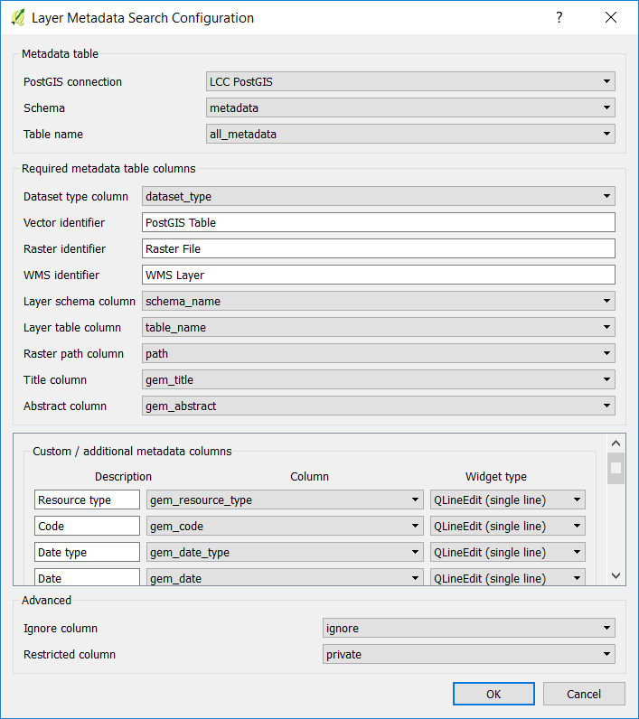

# Layer Metadata Search

Layer Metadata Search is a plugin used to search GIS metadata. Layer Metadata Search can be used to search data describing the "who, what, where, when and how" of map layers. Layer Metadata Search was developed on behalf of Dartmoor and Exmoor National Parks, UK.

Layer Metadata Search requires metadata to be stored in a PostgreSQL table with the following minimum information. Table column names need not be exactly the same as those described below.

**title** - Human readable title of the PostGIS layer, e.g. Ordnance Survey Open Roads.

**abstract** - An abstract for the PostGIS layer, e.g. A nationally consistent, high-level and shareable view of GB's road network. OS Open Roads is a connected road network for Great Britain. It contains all classified roads (such as motorways and A & B roads) as well as officially named unclassified roads.

**other fields** - The plugin can also search on and display other custom metadata fields - described later.

**schema** - The PostgreSQL schema containing the PostGIS table.

**table** - The name of the PostGIS table.

Once configured, Layer Metadata Search will search for PostGIS tables using the title, abstract and any other custom metadata fields.

## Configuration

Layer Metadata Search can be configured in QGIS via `Plugins` > `Layer Metadata Search` > `Configure Layer Metadata Search` which will open the following dialog:

The *Custom / additonal metadata columns* section of the configuration is described later. 

## Metadata Preparation

This section describes how to set up a PostgreSQL table for the matadata.

First, create a new metadata table and schema if required:

	CREATE SCHEMA layer_metadata_search;
	CREATE TABLE layer_metadata_search.metadata
	(
		id serial NOT NULL,
		name text,
		abstract text,
		schema text,
		"table" text,
		CONSTRAINT metadata_pkey PRIMARY KEY (id)
	)
	WITH (
		OIDS=FALSE
	);

With the table created we can automatically populate it with layers we already have in our database. The following command will add rows to the metadata table for any tables not already featured in the metadata table:

	INSERT INTO layer_metadata_search.metadata
		(schema, "table")
	SELECT
		f_table_schema,
		f_table_name
	FROM
		geometry_columns LEFT OUTER JOIN layer_metadata_search.metadata ON
			f_table_schema = "schema" AND 
			f_table_name = "table"
	WHERE
		"schema" IS NULL AND
		"table" IS NULL;
		
Now we can simply open the metadata table in pgAdminIII and add the titles and abstracts:

## Using Custom Metadata Fields

This section describes how to make use of custom metadata fields in the Layer Metadata Search plugin.

1. First ensure that the metadata table contains the fields you wish to work with.
1. Now open up the configuration dialog:

	

	The `+`/`-` buttons can be used to add new metadata entries.

	**Description** - how this field will be displayed in search results.

	**Column** - source metadata column.

	**Widget type** - How the metadata should be displayed.  Options include LineEdit (display as text across a single line), TextEdit (similar but across multiple lines) and DateEdit (for displaying dates).

	*Please note that when using the DateEdit widget the source column in the database should be of type `date`*
